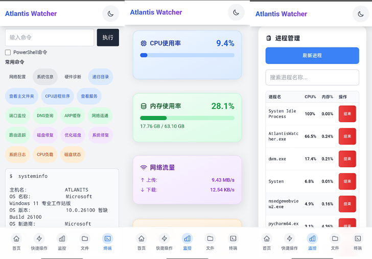

# AtlantisWatcher

AtlantisWatcher 是一个基于 FastAPI 的 Windows 远程控制工具，支持关机、重启、定时关机、取消关机、锁屏、注销、命令行执行、屏幕实时预览，并集成系统托盘和开机自启动，支持系统监控、进程管理、文件管理等功能。

## 功能特性

- **系统监控**：实时显示 CPU、内存、磁盘、网络等系统资源使用情况。
- **进程管理**：查看、筛选、结束系统进程。
- **文件管理**：浏览、上传、下载、重命名、删除、复制、剪切、粘贴文件和文件夹，支持多种文件类型预览（图片、音视频、文本等）。
- **终端操作**：通过 WebSocket 实时操作 Windows 命令行。
- **主题切换**：支持明暗主题一键切换。
- **全屏预览**：支持图片全屏预览及横屏锁定。
- **多端适配**：兼容 PC 和移动端，支持手势滑动切换分区。

## 截图





## 依赖环境

- Python 3.8+
- FastAPI
- Uvicorn
- pyautogui
- opencv-python
- numpy
- pystray
- pillow
- pywin32
- pydantic

安装依赖：
```
pip install -r requirements.txt
```
或手动安装：
```
pip install fastapi uvicorn pyautogui opencv-python numpy pystray pillow pywin32 pydantic
```

## 打包为 EXE

使用 PyInstaller 一键打包（需先安装 PyInstaller）：
```
pip install pyinstaller
python build.py
```
打包后生成的 `main.exe` 可直接运行。

## 使用说明

1. 运行 `main.py` 或打包后的 `main.exe`，程序会自动添加自启动。
2. 托盘图标显示本机 192.168 开头的 IP，便于局域网访问。
3. 用浏览器访问 `http://本机IP:8988`，即可打开控制页面。
4. 支持移动端访问和操作。

打开首页后，左侧导航栏可切换“主页”、“快捷操作”、“系统监控”、“终端”、“文件管理”等分区。
文件管理支持多种操作：右键/菜单可进行重命名、复制、剪切、删除、下载等。
支持多文件上传，支持路径导航和新建文件/文件夹。
进程管理可一键结束进程，支持模糊搜索。
主题切换按钮位于右上角，支持明暗模式。
支持全屏图片预览，移动端双击退出全屏。


## FastAPI 接口

- `POST /shutdown` 立即关机
- `POST /shutdown/{seconds}` 定时关机
- `POST /reboot` 重启
- `POST /cancel` 取消关机
- `POST /lock` 锁屏
- `POST /logout` 注销
- `POST /cmd` 执行命令（支持 PowerShell）

## 注意事项

- 需以管理员权限运行以保证部分操作（如关机、重启）权限。
- 首次运行会自动添加自启动快捷方式到 `%APPDATA%\Microsoft\Windows\Start Menu\Programs\Startup`。
- 屏幕推流和命令执行仅限局域网内访问，注意安全。
- 确保防火墙允许访问 8988 端口。
- 若使用移动端访问，确保手机和电脑在同一局域网内。
- 注意保护局域网的安全，避免未授权访问。

---

如有问题请提交 Issue。